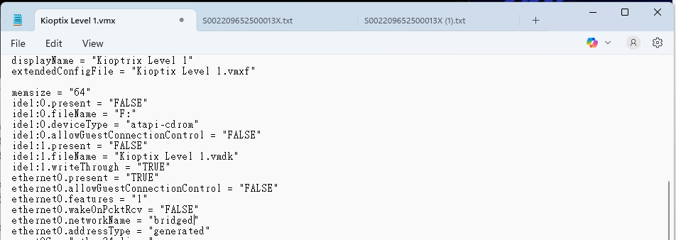
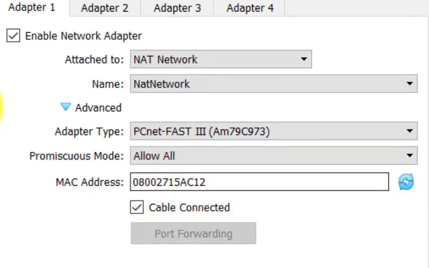
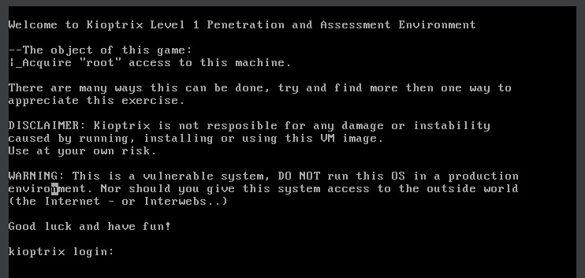

# Kioptrix Level 01
By doing Kioptrix Level 1, we can learn some pen test skills and tools. Learning how to think as a hacker can definitely benefit us when we are on Blue team trying to set up a secure computing evironment for our organization, community, or home system.

## Things I did
I installed Kioptrix Level one samba in a virtual network, and did pen-test with the kali to learn how an outdated OS can potentially be exploited by malicious users, attackers.

## Getting Started

**Dependencies**

- Kioptrix Level 1 .rar file download from [here](https://www.vulnhub.com/entry/kioptrix-level-1-1,22/)
- Kali Linux

**Installing**

1. Once the download finish, modify the `bridged` to `nat` in `Kioptrix Level 1.vmx`

2. Create a new virtual machine in VirtualBox
    - Type : Linux
    - Version : Linux 2.2 (32-bit)
    - Base Memory : 512MB
    - Processor : 2
    - [x] Do Not Add a Virtual Hard Disk

3. Network Configuration
   

4. Storage
   - Kioptrix Level 1.vmdk

5. Start the machine
   

## Acknowledgments

- [TaskMASTER](https://www.youtube.com/watch?v=PYw1kovAt8A)
- [HackerSploit](https://www.youtube.com/watch?v=Qn2cKYZ6kBI)

