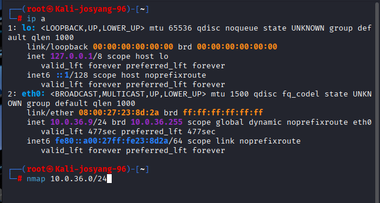
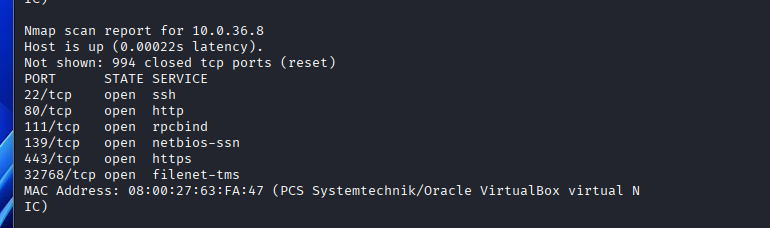
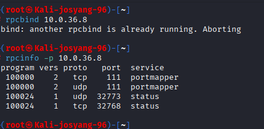
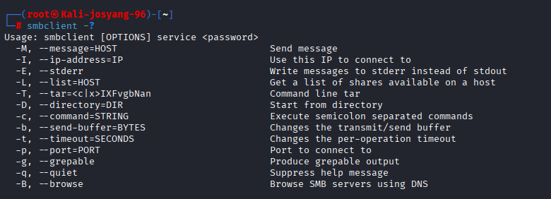
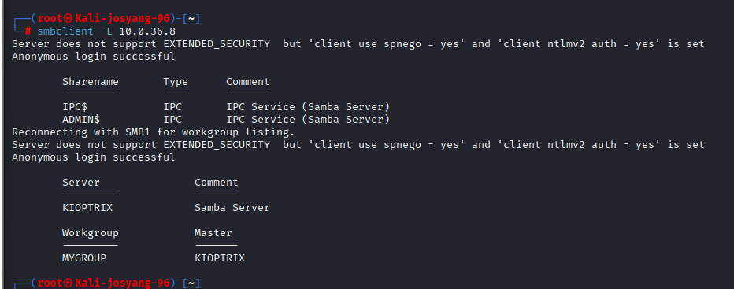
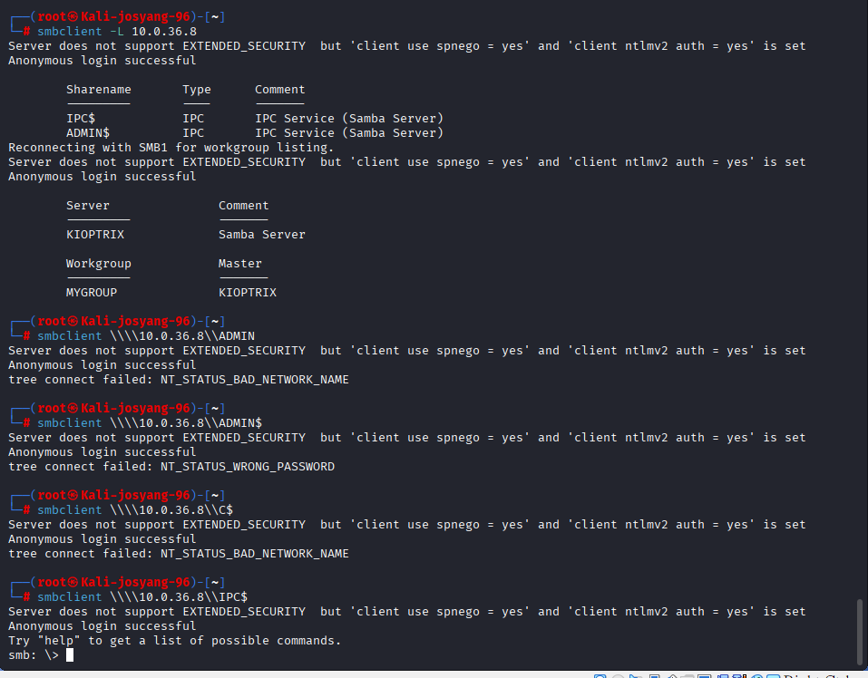
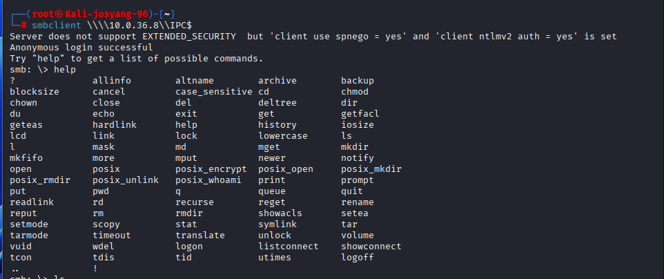

See this once you log in
 
 
 

Try the common credentials

1.admin admin

# Try to hack it from Kali

## In real-world scenerio:

Go to kali. `ip a` see that we are on network `192.168.1.0/24`
 

nmap the network and some common exploit ports e.g. `21`,`22`,`80`,`8080`,`8000`,`139`,`445`,`3306`,`5900`

scan the file and show hosts that have equal to or more than three ports open

Target found

## In virtual network:

`ip a` we are on network `10.0.36.0/24`

`nmap 10.0.36.0/24` got us this. Target is `10.0.36.8` with port `22`,`80`,`111`,`139`,`443` and `32768` open

---

    
    Port 22:
        SSH is used to send commands
        Also allows tunneling and port forwarding

    Port 80:
        http
    
    Port 111:
        RPC(Remote Procedure Call) client can find services and their port numbers by making requests

    Port 139:
        SMB(Server Message Block) over NetBIOS (Used for sharing printers and files in Windows-based networks)
        Can be used to access sever's resources

    Port 443:
        https
    
    Port 32768:
        Back Orifice remote administration tool

Run this command`rpcinfo 10.0.36.8`

---

---

Try `smbclient -L 10.0.36.8`

`smbclient \\\\10.0.36.8\\IPC$ `

