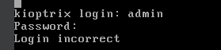
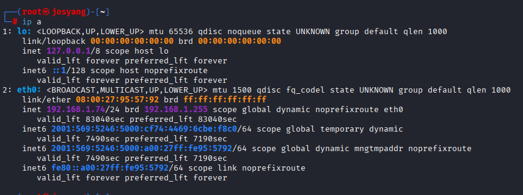
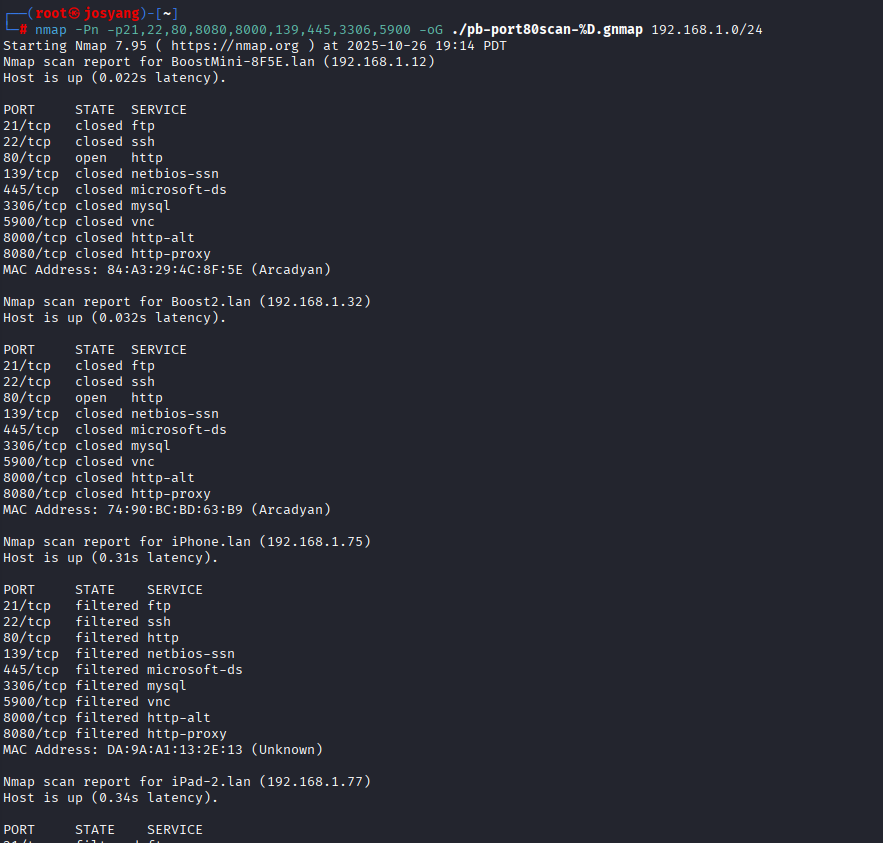
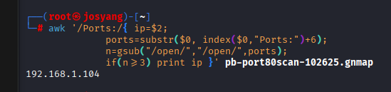

See this once you log in
 
 
 

Try the common credentials
    1. admin admin

Try to hack it from Kali

Go to kali. `ip a` see that we are on network 192.168.1.0/24
 

nmap the network and some common exploit ports e.g. 21,22,80,8080,8000,139,445,3306,5900

scan the file and show hosts that have equal to or more than three ports open

Target found

